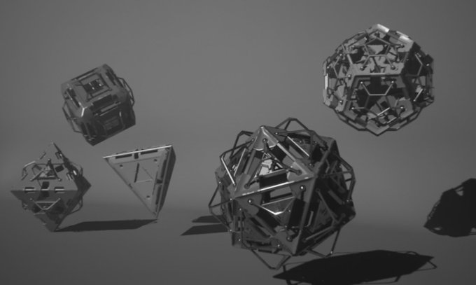
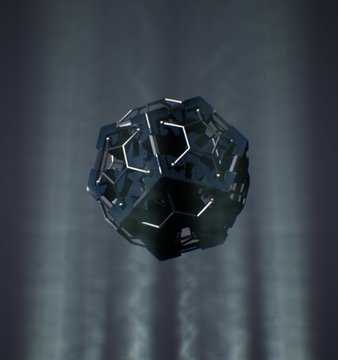
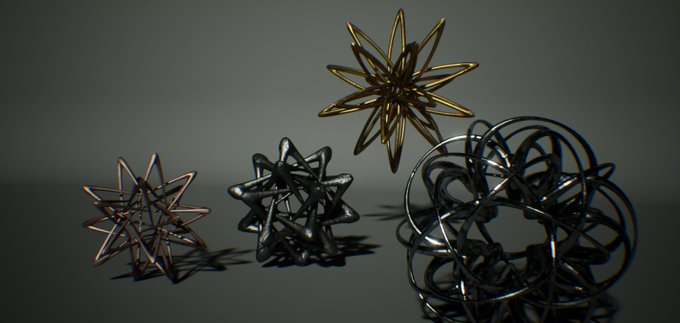
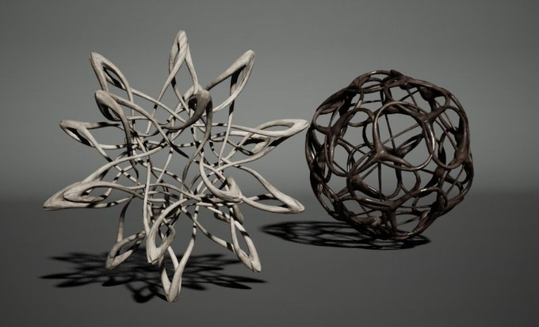

# HDA Sketches

Collection of [Houdini digital assets](https://www.sidefx.com/docs/houdini/assets/intro.html) (HDA).
HDAs should be compatible with game engines such like Unity and UnrealEngine. However they can't work without paid versions of Houdini (Indie) because files are shared as `.hdalc` extension.

## Author
[Ayumu Nagamatsu](https://ayumu-nagamtsu.com)

## License

Creative Commons [CC BY](https://licensebuttons.net/l/by/3.0/88x31.png)

## Gellery

Rendered with Unreal Engine.

|          |               |
|:----------:|:-------------:|
| na_polycrate  |     |
| na_polybridge |  |
| na_orderlytangle |   |
| na_spidron |  |
| na_twistcurve |   | 